# Metasploit-for-reconnaissance
# Metasploit
Metasploit for reconnaissance in pentesting

# AIM:

To get introduced to Metasploit Framework and to  perform reconnaissance  in pentesting .

## DESIGN STEPS:

### Step 1:

Install kali linux either in partition or virtual box or in live mode

### Step 2:

Investigate on the various categories of tools as follows:

### Step 3:

Open terminal and try execute some kali linux commands

## EXECUTION STEPS AND ITS OUTPUT:

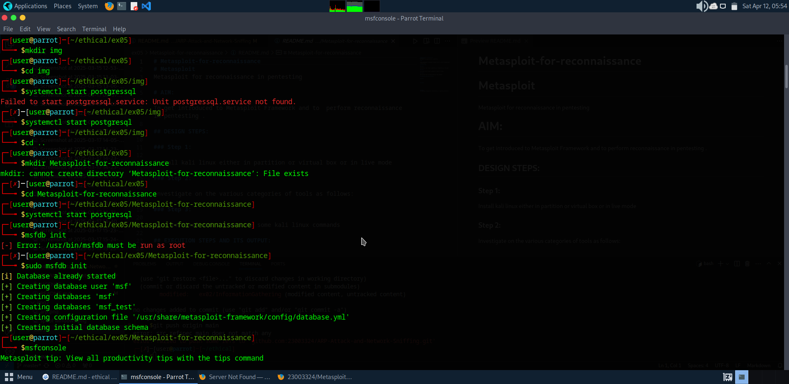

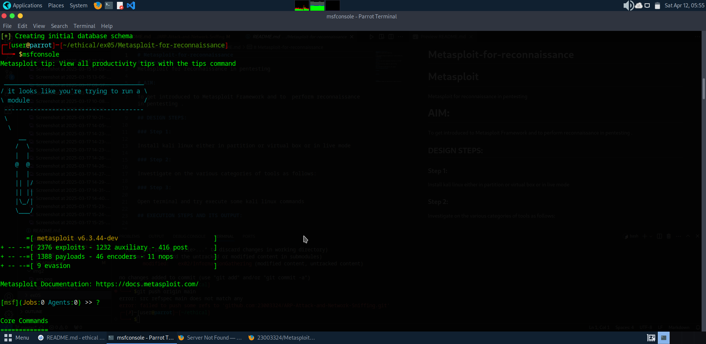
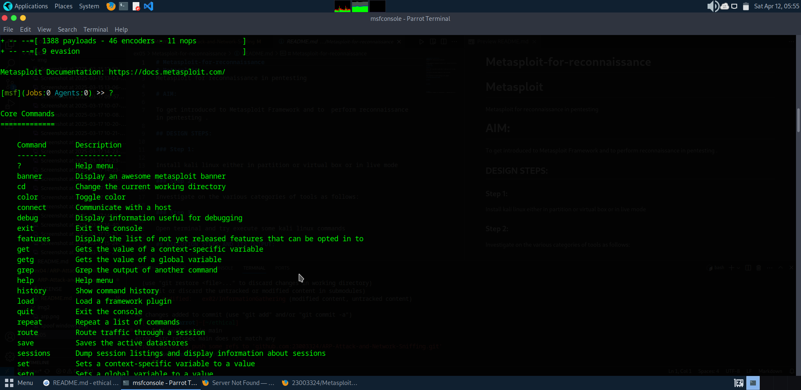

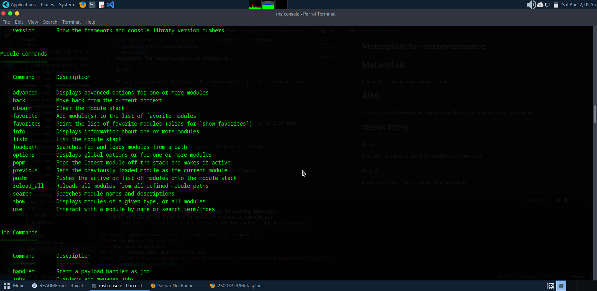

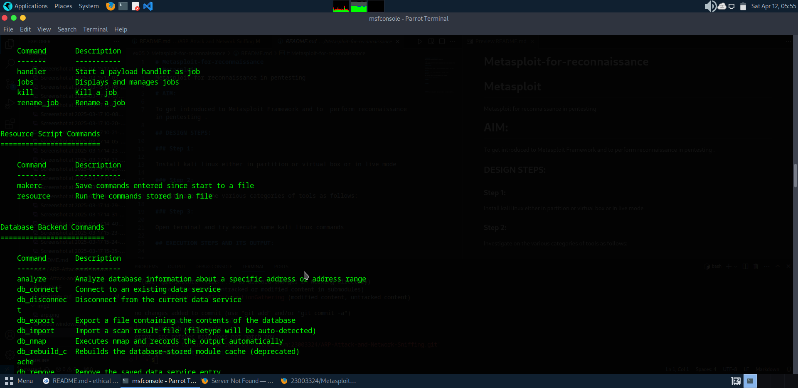

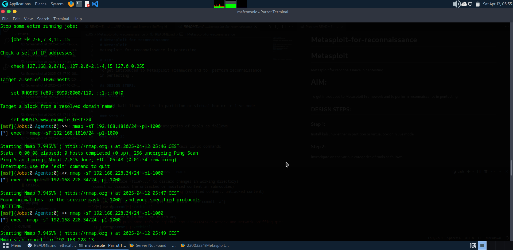

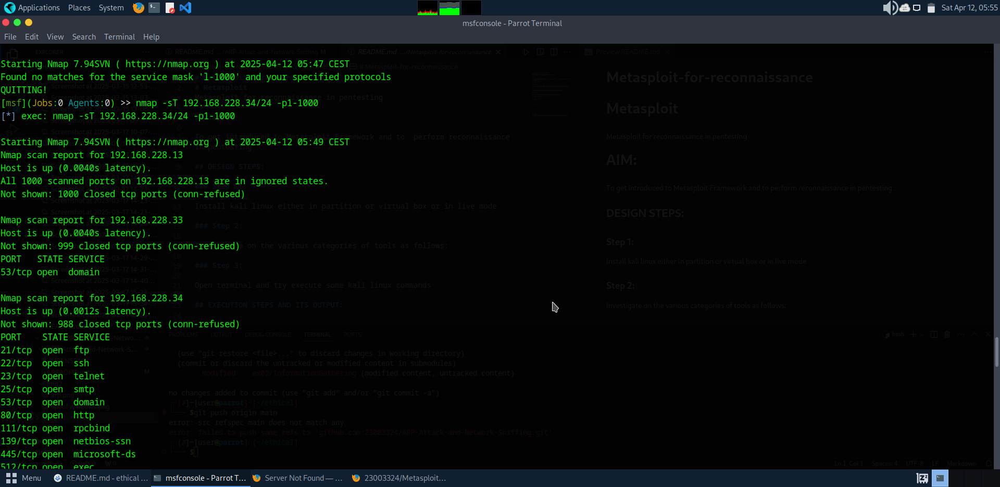

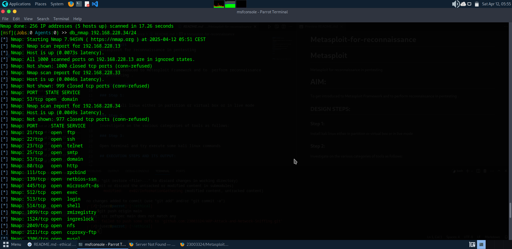

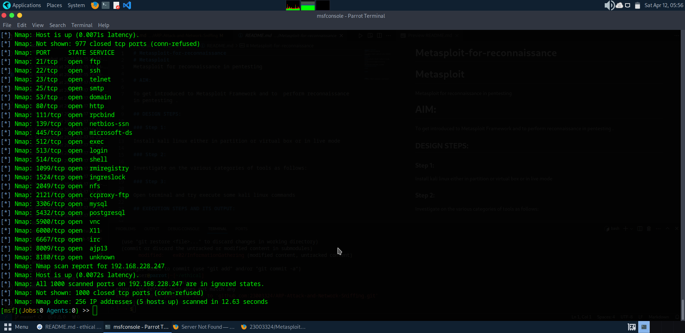

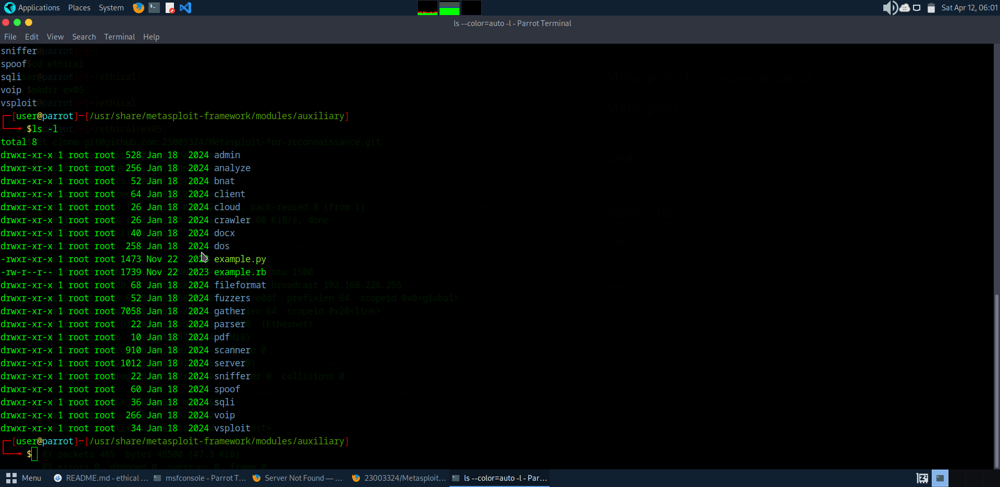

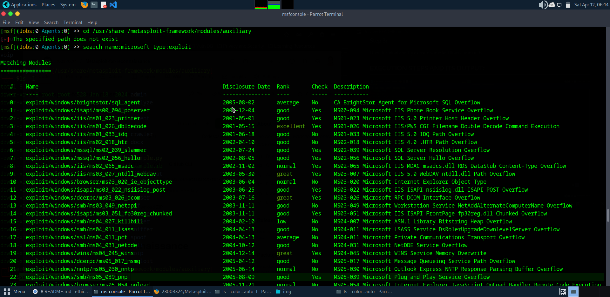

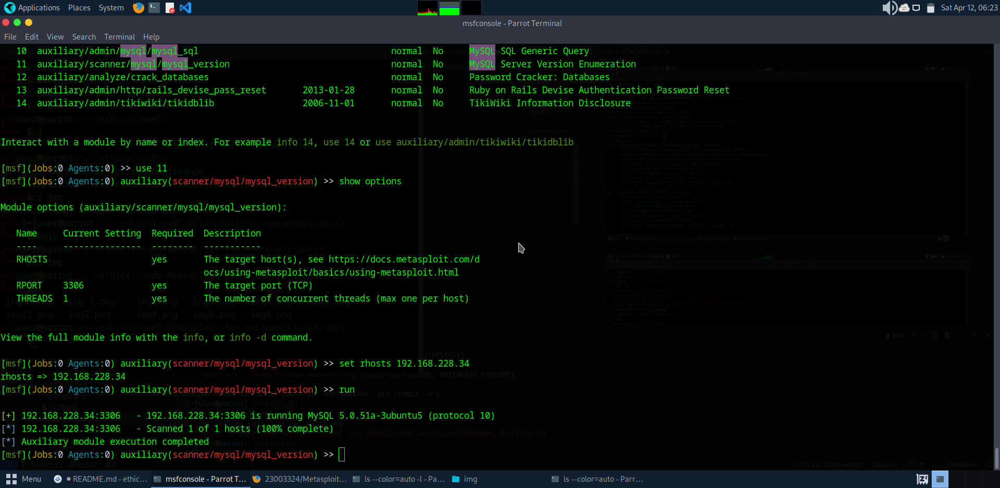

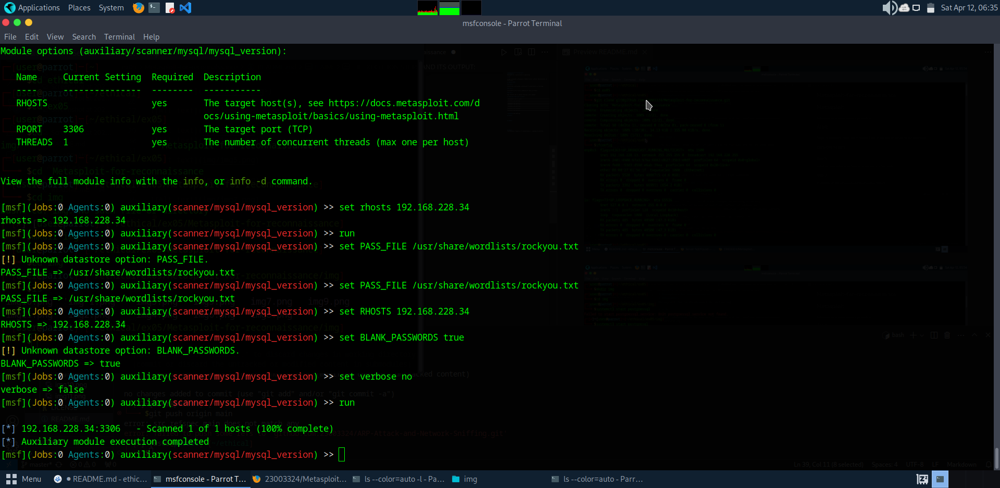

## RESULT:
The Metasploit framework for reconnaissance is  examined successfully
